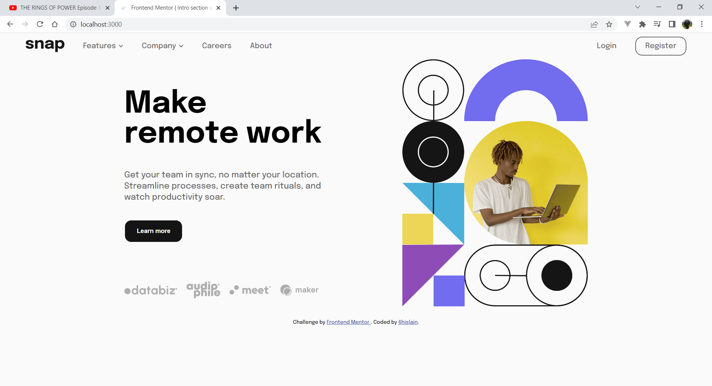

# Frontend Mentor - Intro section with dropdown navigation solution

This is a solution to the [Intro section with dropdown navigation challenge on Frontend Mentor](https://www.frontendmentor.io/challenges/intro-section-with-dropdown-navigation-ryaPetHE5). Frontend Mentor challenges help you improve your coding skills by building realistic projects.

## Table of contents

- [Overview](#overview)
  - [The challenge](#the-challenge)
  - [Screenshot](#screenshot)
  - [Links](#links)
- [My process](#my-process)
  - [Built with](#built-with)
  - [What I learned](#what-i-learned)
  - [Continued development](#continued-development)
  - [Useful resources](#useful-resources)
- [Author](#author)
- [Acknowledgments](#acknowledgments)

## Overview

### The challenge

Users should be able to:

- View the relevant dropdown menus on desktop and mobile when interacting with the navigation links
- View the optimal layout for the content depending on their device's screen size
- See hover states for all interactive elements on the page

### Screenshot



### Links

- Solution URL: [github.com/6hislain/intro-section-with-dropdown-navigation](https://github.com/6hislain/intro-section-with-dropdown-navigation)
- Live Site URL: [demo on netlify](https://symphonious-liger-8ff080.netlify.app/)

## My process

### Built with

- Semantic HTML5 markup
- Flexbox
- CSS Grid

### What I learned

I learnt how to make an overlay menu... I am still learning

```html
<!-- index.html line 93 -->
<div id="myNav" class="overlay">
  <div class="overlay-container">
    <a href="javascript:void(0)" class="menu-button" onclick="closeNav()">
      
    </a>
    <div class="overlay-content">
      <ul class="menu">
        <!-- -->
      </ul>
      <ul class="menu left-menu">
        <!-- -->
      </ul>
    </div>
  </div>
</div>
```

```css
/* css/style.css line 147 */
.overlay {
  height: 100%;
  width: 0;
  position: fixed;
  z-index: 1;
  right: 0;
  top: 0;
  background: hsl(0, 0%, 8%, 0.8);
  overflow-x: hidden;
  transition: 0.5s;
}

.overlay-content {
  position: relative;
  top: 100px;
  width: 100%;
}
```

### Continued development

I am going to try completing more coding challenges on _Frontend Mentor_

### Useful resources

- [How TO - Full screen Overlay Navigation](https://www.w3schools.com/howto/howto_js_fullscreen_overlay.asp) - this article guided me on how to make an overlay menu
- [W3 School - css media queries](https://www.w3schools.com/css/css3_mediaqueries.asp) - this also helped me on media queries

## Author

- Bio Link - [bio.link/6hislain](https://www.bio.link/6hislain)
- Frontend Mentor - [@6hislain](https://www.frontendmentor.io/profile/6hislain)
- Twitter - [@6hislain](https://www.twitter.com/6hislain)

## Acknowledgments

Thanks to [correlucas](https://twitter.com/brandaodelucas) suggestions and feedback, on how to tackle _Frontend Mentor_ challenges
